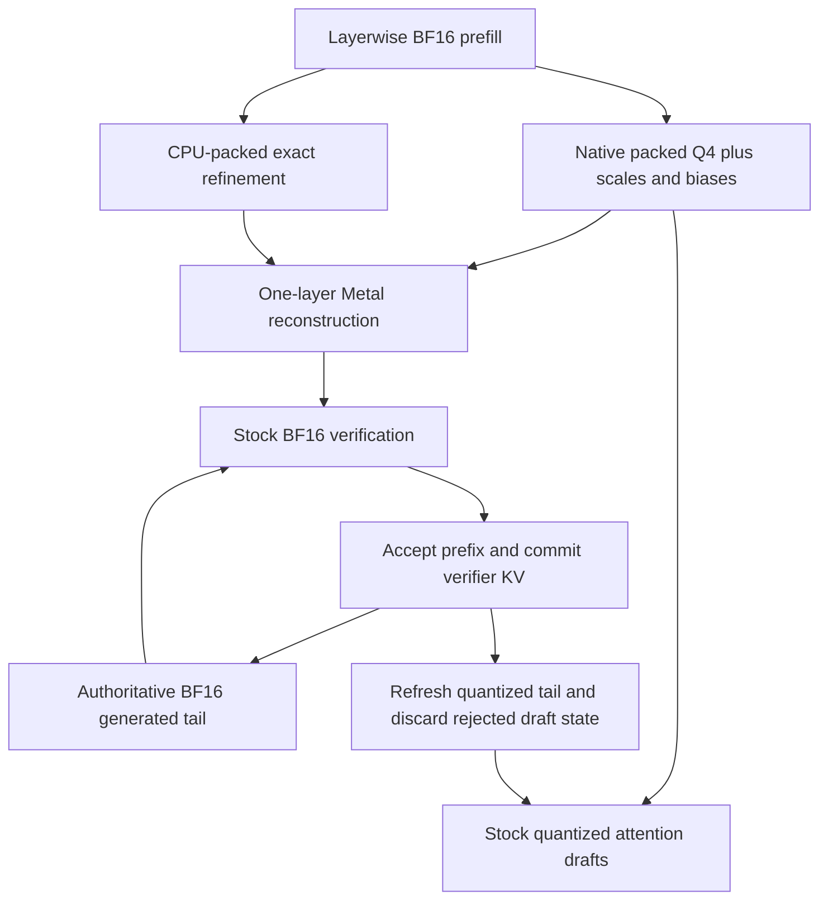

# ExactKV: exact refinement of a native quantized KV cache

Date: 28 September 2026. Status: implementation specification; no experimental gates have passed. This document and its companion plan are the requested deliverables for the current documentation task. Runtime implementation is subsequent work.

## 1. Intent and claim boundary

Build a small, reproducible research PoC on one M3 Max to determine whether an unchanged native MLX Q4 prompt cache can serve both approximate attention and bit-exact reconstruction of its original BF16 K/V. Encode the missing information as ranks in quantizer-conditioned intervals. Reconstruct at most one layer at a time for ordinary BF16 verification.

The intended user needs original-cache fidelity or verified decoding and benefits from avoiding separate approximate and exact caches. Success is measured against practical independent exact codecs as well as raw BF16. An informative early no-go is a successful research outcome. No compression ratio, speedup, or novelty result is assumed.

The proposed distinction combines native packed low-bit execution, original BF16 recovery, intervals conditioned on existing Q/scales/biases, and bounded exact working state with all physical memory charged. Conditional coding, speculative decoding, floating-point compression, hierarchical caches, and fused decompression are prior art. A Metal port alone is not novelty.

Three approaches were considered:

| Approach | Decision and trade-off |
|---|---|
| Native Q4 plus conditional interval ranks | Selected experiment: little extra decoder metadata, but interval arithmetic and literal fallbacks may erase the advantage. |
| Native Q4 plus independent exact compression | Required competitor: simpler decoding may dominate despite duplicating information. Also test exact compression without Q4. |
| New quantizer, learned predictor, or replacement attention | Outside this PoC: changes the question and creates expensive dependencies before evidence supports them. |

## 2. Fixed scope and current repository

The repository is named `ExactKV`; `exact-kv-refinement-poc` is only the descriptive project/distribution name, with import package `kvrefine`. Work stays on the current `main` branch as requested. The repository had no tracked files or commits when planning began. Do not create a nested repository, switch branches, or create a worktree for this task.

### Global constraints

- Platform: one local Apple M3 Max; batch size 1.
- Environment: ARM-native Python 3.12 or a demonstrated compatible existing ARM-native environment.
- Dependencies: Python, NumPy, MLX, MLX-LM, pytest, huggingface_hub, zstandard; datasets only if its loader is used.
- Model: official `Qwen/Qwen3-0.6B`, original BF16 weights, immutable model/tokenizer revision, no training or weight modification.
- Geometry: verify 28 layers, 16 query heads, 8 KV heads, head dimension 128 at runtime.
- Context: prompt plus every actually processed candidate block stays within 32,768 positions.
- Approximate view: native MLX affine Q4, group size 64, original codes/scales/biases unchanged.
- Exact source: original BF16 post-RoPE K and actual V as consumed by attention.
- History: immutable compressed prompt; at most 256 emitted output tokens; authoritative BF16 generated tail.
- Verification: deterministic greedy, non-thinking template, initial draft horizon 4; development ablations only at 2, 4, 8.
- Staging: one layer of exact K/V, with at most one additional layer-sized assembly buffer, measured and charged.
- Implementation order: CPU reference and evidence gates before any custom Metal reconstruction.
- Excluded: stochastic sampling, batching, eviction, networking, offload memory claims, persistent sessions, prefix sharing, tensor parallelism, sliding windows, training, GPU variable-output packing, rANS, a dynamic allocator, custom attention.
- No CUDA, PyTorch, distributed serving framework, Docker, or experiment-tracking service dependency.

Planning observations (not a `doctor` result): macOS 26.6.2 build 25G83, arm64, Apple M3 Max, `hw.memsize=38654705664` (36 GiB). `/opt/homebrew/bin/python3.12` is ARM-native Python 3.12.9; the default `python3` is 3.14.6. The 3.12 interpreter has NumPy 2.3.1 but no installed MLX, MLX-LM, pytest, huggingface_hub, or zstandard distributions. The repository volume reported about 23 GiB available. Recheck all observations at execution; they do not establish GPU compatibility or available application memory.

The official config currently says `max_position_embeddings=40960`; the model card advertises 32,768. Retain the smaller limit and record both in the environment report. The dimensions above agree with the inspected config. See [source notes](../../research/2026-09-28-source-audit.md) for checked URLs and unresolved literature.

## 3. Architecture and responsibilities



Use one shared model object. The model adapter invokes existing Qwen modules, preserving normalization, GQA, RoPE, masks, positions, and weight tying. A cache provider supplies a layer's historical KV; verifier logic does not know which exact codec provided it. Exact attention objects must not expose the `bits` marker that selects quantized attention in the inspected MLX-LM dispatcher.

The eventual modules are created only when their gate needs them:

| Module under `src/kvrefine/` | Responsibility |
|---|---|
| `cli.py`, `doctor.py` | Bounded commands, explicit gate failures, environment and native smoke checks. |
| `records.py`, `gates.py` | Typed identities/configuration/results, artifact schemas, dependency decisions. |
| `data.py` | Pinned public source selection, disjoint manifests, exact templated token IDs. |
| `native.py` | Native Q4 layout, BF16 bit views, ABI fingerprint, bounded word export. |
| `bits.py`, `codec.py`, `format.py` | Reversible words, canonical intervals/packing, strict page/container validation. |
| `baselines.py` | Independent palette, field-split Zstd, exact XOR size control. |
| `model.py`, `cache.py`, `verify.py` | Existing model adapter, ownership/staging/tails, pending-token state machine. |
| `metal.py` | Endpoint diagnostics and small exact interval/palette decoders. |
| `metrics.py`, `bench.py`, `report.py` | Ownership ledger, synchronized timings, sequential experiments and conclusions. |

CPU codec modules must import without MLX. CLI help, parser tests, and reports must run without downloading weights. Test markers separate `metal`, `model`, and `slow` runs from the default offline suite.

## 4. Gated research contract

Every gate writes a durable decision with input artifact hashes, code/environment identity, evidence, conclusion, one optional repair, and allowed next work. Statuses are `pass`, `narrow`, `stop`, `blocked`; an unavailable paper alone does not stop a provisional experiment. A narrowing decision explicitly names which downstream work remains justified. Missing evidence never counts as a pass. Record the producing commit for provenance and relevant implementation/input hashes for validity: unrelated later commits do not invalidate every previous gate, but changed numerical code, format, ABI, model, or other gate dependencies require affected checks to rerun.

| Gate | Smallest work and evidence | Condition for dependent work |
|---|---|---|
| G0 | Environment, tiny BF16/Q4 tests, native ABI fixture, focused prior-art audit | Stack and numerical layout work; novelty distinction remains plausible or work is explicitly reclassified as reproduction. |
| G1 | One 512-token development prompt per domain, every layer/head; conditional and independent serialized sizes | Credible useful memory point after Q/S, metadata, one/two stages, tails, and copies. Add two 2K prompts/domain only if promising. |
| G2 | Raw-dual verifier and stock operators on small development inputs | Measured acceptance and `r=0` bound leave reconstruction time or justify a declared capacity use case. |
| G3 | Full CPU format/bit/parser proof suite | Original words recover exactly; serialized counts and estimator agree; corrupt inputs fail. |
| G4 | CPU/GPU endpoint agreement, real layer decode, decode plus stock attention | Measured reconstruction and staging fit the opportunity from G2. |
| G5 | Paired verifier, rejection/limit tests, bounded 256-output session, repeated-session cleanup | E1/E2 pass and live state remains bounded; E3 separately qualified. |
| G6 | One 8K development run, freeze choices, then five held-out 8K prompts | A named workload has a reproducible memory/latency point against all relevant exact baselines. 16K is conditional. |

G1 needs a small working CPU encoder/decoder to measure actual bytes. G3 hardens that same implementation after G2, rather than building a second codec. Basic exactness and membership checks are mandatory even for G1. Any failed gate allows one motivated local repair with original failure evidence retained; otherwise stop dependent work and produce the report.

Prior-art audit uses this question: does a system keep unchanged native low-bit KV, encode the missing original BF16 bits conditional on that view, and reconstruct bounded exact verification state with every side input counted? Read mechanisms/evaluation in PackKV, QuantSpec, Lynx, VeriCache and current FAFO; attempt full Vayne/ProofKV papers or official code individually before Metal. Record sections, versions, retrieval failures, and overlap evidence. Direct overlap changes the claim to reproduction/platform adaptation. Inaccessible content keeps novelty provisional. The planning source check does not close G0.

## 5. Normative numerical codec

### 5.1 Source words and reversible order

Read BF16 words by true bit view, never numeric conversion of uint16. For all 65,536 patterns:

```text
ord(b) = (~b) & 0xffff if b & 0x8000 else b ^ 0x8000
inv(k) = k ^ 0x8000 if k & 0x8000 else (~k) & 0xffff
```

These are inverse permutations; finite keys are numerically ordered with separate signed zeros. Use unsigned words and at least 32-bit integers for intervals and ranks. Literal mode preserves every NaN payload, infinity, signed zero, and subnormal word. Numerical inference tests use finite real-model state.

### 5.2 Intervals derived from unchanged native metadata

Each 64-value group has mode 0 (tight, alpha=1/2), 1 (wide, alpha=1), 2 (literal), or 3 (invalid). All arithmetic below is an explicit FP32 operation with the shown rounding boundary; multiplication/addition must not fuse:

```text
p = f32(f32(f32(q) * f32(s)) + f32(bias))
r = f32(alpha * abs(f32(s)))
a = f32(p - r)
z = f32(p + r)
L = max(0, ord(RNE_BF16(a)) - 1)
U = min(65535, ord(RNE_BF16(z)) + 1)
n = U - L + 1
w = bit_length(n - 1)
```

BF16 metadata promotes exactly to FP32. RNE conversion is implemented using FP32 integer bits: for finite inputs add `0x7fff + ((bits >> 16) & 1)` to the uint32 bit pattern with modular arithmetic, then take its upper 16 bits; test ties, both signs, overflow to infinity, and signed zero. Nonfinite conversion is outside the interval path. The CPU reference must not accidentally compute intermediates in Python double precision.

Use literal mode for zero scales, nonfinite source or metadata, nonzero BF16-subnormal source/metadata, any nonzero FP32-subnormal intermediate (including the multiplication before addition), nonfinite/unordered bounds, and nonzero BF16-subnormal rounded endpoints or outward neighbors. Outward neighbors must also be finite; expansion into infinity is unsupported. Exact zero is allowed. Negative scales are supported using `abs(s)` for radius. Evaluate these predicates identically on CPU and GPU before admitting an interval mode.

For each element, compute its own `L/U/w` from its own q and shared s/bias. Admit a group mode only if every original key is in its predicted interval. Store `rank=ord(f)-L` in w bits. Decode by rederiving identical bounds, rejecting `rank>=n`, and returning `inv(L+rank)`. Checked membership, integer packing, and interval agreement establish exactness; the interval is not claimed to be the quantizer's mathematical preimage.

Select the valid mode minimizing total group payload bits. Literal costs 1,024 bits. Ties prefer literal, then tight, then wide, keeping unnecessary predictor arithmetic out of equal-sized groups. This minimizes restart extent because each group has the same mode-map cost and restart padding is monotone in total bits. Endpoint expansion makes w=0 unlikely in real intervals, but bitstream helpers must handle it.

Do not use a floating residual `F-dequantize(Q)` as an exact representation. An exact XOR control uses `source_word XOR bitcast_bf16(native_dequantized_Q)` with the pinned native dequantization operation/dtype; retain its identity and charge its compression overhead.

### 5.3 Canonical page format, version 1

One page is at most 4,096 values (32 tokens x 128 channels) for one layer, one KV head, one K/V role. Preserve native token/channel order. Group=64; restart=128. Support nonempty page lengths divisible by 64 up to 4,096. A tensor of length zero contains zero pages; reject other unaligned lengths rather than inventing compressible padding. Real tensors end on 128-value token boundaries.

All multibyte fields and packed bitstreams are little endian. Page layout:

| Byte offset | Field |
|---|---|
| 0 | Four bytes `EKVR`. |
| 4, 6 | u16 format version (=1), u16 header size (=32). |
| 8, 12 | u32 tensor descriptor index, u32 page index within that tensor. |
| 16 | u16 valid count (64..4096, divisible by 64). |
| 18, 19 | u8 group count, u8 restart count, each checked against valid count. |
| 20, 24 | u32 total page bytes, u32 payload extent in 32-bit words excluding guard. |
| 28 | u32 reserved (=0). |
| 32 onward | Two-bit group modes, low bits first; pad mode bytes to a 4-byte boundary with zeros. |
| Next | u32 restart word offsets, restart_count+1 entries, first zero and last payload extent. |
| Next | Packed restart payloads, each separately rounded to a 32-bit word boundary. |
| Last | One zero u32 guard, counted in total bytes. |

For each restart, pack interval ranks or literal 16-bit words in element order, least significant bit first. A final restart can contain one complete group. Pad all unused bits to zero. Offsets must increase exactly by the extent implied by the two groups (or last one); reject merely in-range but inconsistent offsets. Derive expected widths before decoding untrusted streams. Guard access must still be bounded: the guard does not license reads into another page.

Use a compact tensor descriptor table and flat arenas. Each descriptor binds model/tokenizer snapshot, cache construction identity (tokens, dtype, positions/masks, prefill path), layer, K/V role, head, valid shape, Q-page version, native packing ABI, scale/bias dtype, and side-information hash. Store long shared identifiers once in a canonical manifest. Version-1 container framing is `EKVT`, u32 version, u64 canonical-JSON manifest length, UTF-8 JSON (sorted keys, compact separators), zero padding to 8 bytes, then the arena. Manifest page offsets are u64-range byte offsets relative to the arena; each page remains 4-byte aligned. Charge manifest bytes, descriptor arrays, and any simultaneous CPU/GPU copies.

Side-information digests cover exact Q/S/bias bytes and valid layout, verified during ingest before references become immutable. Hashes identify mismatches, not an adversarial security guarantee. Unknown ABI/version, wrong identity, modified metadata, stale Q pages, malformed lengths, reserved bits/modes, invalid ranks, or overflow produce a typed format error. Use checked 64-bit address products even with u32 page-relative word offsets. No global 32-bit bit offsets.

## 6. Independent codecs and fair controls

Implement a small independent exponent-palette codec per 4,096-value page. Separate `sf=((word>>8)&0x80)|(word&0x7f)` from `e=(word>>7)&0xff`. Store sf bytes, a sorted distinct exponent palette, and fixed-width indexes of width `bit_length(palette_size-1)`; singleton width is zero. Rebuild the word as `((sf&0x80)<<8)|(palette[index]<<7)|(sf&0x7f)`. Include identity, header, palette/count/width, restart index if used, padding, and raw fallback when actual compressed size would expand. Preserve all patterns. This borrows a field-separation principle; it is not an official SplitZip reproduction.

Also measure independent per-page Zstd of exponent and sf byte streams, with two frames and all framing/index costs, and conditional XOR plus per-page Zstd. Whole-stream Zstd can be a labeled size reference only. Zstd CPU timing is not a fair GPU-decoder speed comparator. Use one fixed documented Zstd level (3 initially), not a codec search.

| ID / CLI backend | Required execution |
|---|---|
| B0 / `bf16` | Stock BF16 KV single-token autoregression. Also record a raw control using the same layerwise schedule. |
| B1 / `q4` | Stock native Q4 unverified generation; explicitly lossy. Q8 optional. |
| B2 / `raw-dual` | Q4 drafting plus raw BF16 prompt with the identical verifier. G2 opportunity/correctness control. |
| B3 / `palette-dual` | Q4 plus independently palette-coded prompt, layer staging, identical verifier. |
| B4 / `palette-exact` | Palette prompt without Q4, layer-staged exact autoregression. |
| B5 / `refine` | Q4 plus conditional refinement, identical verifier. |

B2/B3/B5 share horizon, target shapes/operators, commit logic, layer barriers and quantizer metadata. Saved candidate-trace replay attributes component costs; free generation establishes actual behavior. B3/B4 get a small Metal palette decoder so a slow Python baseline cannot manufacture a win. If independent coding dominates memory and plausible latency at G1, stop this representation. A win only over raw duplication is insufficient.

## 7. Construction, ownership, and memory

### 7.1 Byte ledger

Use `F` for raw BF16 prompt, `Q` for packed codes, `S` for scales/biases, `R` for ranks/literals, `I` for all metadata/padding, `E` for exact stages, and `T` for tails/candidates. Charge:

```text
shared_prompt = Q + S + R + I
cache_peak = shared_prompt + E + T + transient_copies
process_peak = cache_peak + weights + activations
             + unused_allocator_reservations + other_nonoverlapping_overhead
independent_dual = Q + S + CompressExact(F) + overhead
```

The process expression is a conceptual decomposition, not permission to sum overlapping telemetry. Compare independently compressed exact-only execution and raw exact execution as well. NumPy memory occupies the same physical budget as MLX on this machine. Count aliasing once by backing allocation, and count actual CPU/GPU mirrors separately. Never sum RSS with MLX active/reserved counters.

For the expected model, `F=2*28*8*T_tokens*128*2=114688*T_tokens` bytes: 512=56 MiB, 2,048=224 MiB, 8,192=896 MiB, 16,384=1,792 MiB. A layer at 16K is 64 MiB for K+V. Native BF16-metadata Q4 ideally uses 36/128=0.28125 of F; confirm allocation capacity and metadata dtype. Native capacity rounded in 256-token steps can increase this.

The illustrative `Q+S=0.28125F`, `R+I=0.50F`, two stages `2F/28` totals `0.8526786F` (about 1.492 GiB at 16K) before tails/unequal costs. It is arithmetic, not a forecast. The 256-token exact tail itself has up to 28 MiB payload across all layers; candidate and native capacity overhead is additional.

### 7.2 Layerwise construction

Small G1 diagnostics may capture the entire exact cache. Final peak claims require layerwise prefill with the existing modules. For each layer, compute BF16 KV and ordinary attention, evaluate next hidden state, quantize/store its native view, encode refinement, then release raw KV and temporary NumPy words before proceeding. Only project the final prompt hidden position to vocabulary logits. Matching baselines use the same last-token optimization.

Retain no full-model BF16 prompt after construction, no raw trace mapping, and no second model. Evaluate lazy outputs before dropping inputs; inspect reference ownership and measured high-water marks. A layer-local CPU packing mirror is allowed and charged. A growing CPU archive while exporting layers is not bounded construction.

Compare stock prefill against a raw layerwise control first; isolate any numerical difference before codec integration. Report schedule-only savings separately from codec savings. Refuse construction that exceeds the predeclared application budget; do not reconstruct a full exact cache as an emergency fallback.

### 7.3 Steady state and staging

Retain native prompt Q/S and refinement for all layers, exact committed BF16 tails for all layers, and quantized tail/candidate capacity. Reserve at initialization for 256 outputs plus the maximum verification block (9 tokens for horizon 8); count the actual native capacity. Immutable prompt and mutable tail may share a preallocated native backing allocation, but writes may touch only the tail region. No whole-prompt concatenation per draft token.

At each verifier layer, decode prompt KV into one reusable stage and assemble its committed exact tail plus this block's new KV. Use one assembly stage when possible; at most one extra layer-sized prompt buffer is initially permitted. Stock BF16 attention consumes it. Evaluate hidden output and small new KV, detach/copy the small KV if a view would retain the stage, release stage dependencies, then advance. Candidate exact KV across layers is bounded by `g+1` tokens, never a prompt-sized list.

Flat byte arenas and compact descriptor arrays replace one Python object per tiny page in deployment. Reject stale side information before dispatch. The prompt representation has one authoritative Q version. Codec/decode failures terminate the request with a saved reason, never approximate success.

## 8. Verifier state machine and correctness levels

The authoritative cache contains prompt plus committed continuation except exactly one pending token `u`, already emitted from exact logits. After prefill, emit the exact argmax of last-prompt logits and make it `u`. For `max_new_tokens=0`, emit nothing and never create a pending state; for EOS or a one-token limit, terminate immediately after the first emission.

For a continuing round:

1. Let `remaining=output_limit-emitted_count`. Set `g_eff=min(horizon, remaining-1, context_limit-exact_cached_length-1)`. A negative available context ends with a recorded context-limit result; no out-of-range model call. A zero horizon is a valid exact single-input round.
2. Draft `g_eff` tokens `d1..dg` starting from pending `u` with approximate sequential execution. If draft EOS appears, stop proposing beyond it; it still needs verification.
3. Verify input `[u,d1,..,dg]` against exact cached history using a causal block mask. Logit j predicts the next token after input j.
4. Let a be the matching prefix length before the first mismatch, or g for full acceptance. Commit verifier-generated KV for `[u,d1,..,da]`. Emit `d1..da`, then exact argmax at logit a as the new pending token. Each ordinary round adds a+1 outputs.
5. Replace committed approximate tail slots with freshly quantized verifier KV. Trim/invalidate rejected draft slots and all stale views. Approximate hidden-state KV is never authoritative, even for matching IDs.

If an accepted candidate is EOS, emit through that EOS, commit only inputs preceding it, leave EOS as the terminal pending token, and emit no bonus. Likewise an exact mismatch/bonus EOS terminates uncached. The `remaining-1` cap avoids output-limit over-emission without post-hoc inconsistent commits. Processed candidate positions, not only emitted tokens, must obey the context limit. Define deterministic tie behavior using the pinned target argmax; match stock and oracle tests.

Hand trace with already emitted u=10:

| Case | Draft | Exact next choices | New emitted | Newly cached inputs | New pending |
|---|---|---|---|---|---|
| Immediate rejection | 11,12 | 20,... | 20 | 10 | 20 |
| One acceptance | 11,12 | 11,20,... | 11,20 | 10,11 | 20 |
| All accepted | 11,12 | 11,12,13 | 11,12,13 | 10,11,12 | 13 |
| Accepted EOS=11 | 11 | 11,... | 11 | 10 | 11 (terminal) |

For a two-round trace, follow immediate rejection with pending 20, draft [21,22], target [21,30,...]: newly cache [20,21], emit [21,30], and leave 30 pending. Aggregate emitted [10,20,21,30] and continuation cache [10,20,21] differ by exactly the last token.

| Level | Contract and test |
|---|---|
| E1 | Reconstructed prompt uint16 words and retained verifier-tail words equal originals bit for bit. No tolerance. |
| E2 | Raw/shared cache under identical verifier shapes, operators, tokens, masks, and positions produces identical logits, decisions, and new KV in the pinned deterministic configuration. |
| E3 | Entire output token sequence agrees with stock single-token BF16 greedy generation. Test independently; batched reduction differences may violate it despite E1/E2. |

Establish raw batched verifier versus stock generation before blaming compression. If E3 diverges, capture first logits/tokens, operator shapes and decision margins; try the allowed local repair or strict tokenwise verification control and measure its cost. Claim only exact-cache behavior under the specified verifier if stock equivalence remains qualified. Never replace E1/E2 with perplexity or global tolerances.

## 9. First Metal consumer

Use `mx.fast.metal_kernel` with a tiny endpoint diagnostic first. BF16 s/bias are read as uint16 and expanded into FP32 by bits; output uint16 words get a true BF16 bit view. A proposed mapping is one SIMD group per 128-value restart, four consecutive values per lane, exclusive SIMD prefix-summed widths; verify the installed SIMD width and launch contract before relying on 32 lanes.

Disable unsafe arithmetic contraction through an available compiler option or deterministic tested helper. Do not assume a particular API provides such a switch. CPU/GPU L/U/w and exception predicates must agree before packed streams can be consumed. Literal fallback at encode time cannot fix later divergent widths.

Handle widths 0 and 16, cross-word reads, last guarded word, last partial restart, address overflow, first/last lanes, and distinct K/V indexing. Require contiguous native arenas initially and charge any conversion. Reject malformed ingest on CPU; a development GPU error buffer checks ranks/address assumptions. Benchmark output bytes/second, all-layer decode time, and decode plus the same stock attention call. No per-element global offset array, fully expanded Q cache, large per-scale table, or custom attention.

## 10. Data, measurements, and decision policy

### Data and manifests

Use WikiText training whole articles for development and disjoint validation/test articles held out; pinned CPython stdlib files with held-out files from different top-level subdirectories; seeded structured JSON/logs with disjoint seeds/templates. Preserve revisions, filenames/article boundaries, source license notices and terms. No generated code or benchmark-document instruction is executed. Remote model code stays disabled.

Start with one 512-token prompt/domain, every layer/head. If promising use two 2K prompts/domain, then one 8K development prompt. Concatenate distinct material with recorded separators rather than repeating paragraphs. Store the exact final token IDs including BOS/chat template with `enable_thinking=False`. Record source identity/split/hash, tokenizer/model revisions, text/token hashes, length, seed, and generation configuration. Validate disjointness by source identity as well as text hash.

Freeze codec rules, horizon, target verifier mode, and a named use case before held-out testing. Held-out: two prose, two code, one structured 8K prompt, 128 committed outputs per request. 16K follows only a useful 8K result. One development run at 256 outputs is a lifecycle boundary test, not a headline throughput sample. A second model codec-only check is optional after a positive primary result.

### G1 and G2 decisions

Report actual raw/native allocation, Q/S, ranks/literals, all headers/indexes/guards/padding, mode rates, rank-width histogram, K/V and layer/head spread, weighted totals, and largest stage. Compare raw, Q4, proposed dual, independent palette dual, field-split Zstd dual, independent exact-only, and XOR control. Show one/two-stage plus tail peak estimates in MiB and ratio; distinguish estimates from physical peaks.

G2 measures `d` (one draft step), `v(g+1)` (exact verification excluding refinement), `u` (rollback/refresh/commit/dispatch), observed `A` (new committed outputs/round), and eventually `r` (all-layer refinement). Model time/output as `[g*d+v(g+1)+r+u]/A`. First set r=0. Use observed accepted prefixes, not an independent-token acceptance assumption; account for shortened terminal rounds explicitly. If zero-cost reconstruction cannot meet a declared latency/capacity use case, stop before Metal. No optimistic overlap is assumed.

Development ablations: tight-only versus tight+wide, interval versus XOR+Zstd size, counted Q/S versus explicitly invalid omitted subtotal, one/two stages, horizons 2/4/8. Do not retune on held-out outcomes.

### Timing and physical memory

`doctor` records sw_vers, architecture, actual RAM, CPU/GPU/Metal availability, Python/package versions, installed MLX/MLX-LM file hashes/revisions, disk headroom, power mode, and tiny BF16/native-Q attention plus model smoke results. Pin snapshots and freeze a working environment only after the smoke test. Check disk before downloading; avoid storing complete large traces. The environment report distinguishes unavailable observations from zeros.

Use AC power and fixed power mode. Declare an application budget from current available headroom plus a documented OS reserve; 36 GiB installed is not a 36 GiB budget. Never increase wired-memory limits or disable protection. Log `vm_stat`, `sysctl vm.swapusage` and available pressure/thermal observations. Pre-existing swap is recorded; new swap traffic, pressure stalls, or thermal drift invalidates the run and triggers stop/reduction before retry.

Explicitly evaluate lazy outputs and synchronize timing boundaries. Warm kernels; report compilation/model-load separately. Compare in clean sequential processes or proven cleanup, alternate paired order (A-B-B-A), and never run performance baselines concurrently. Use identical allocator clearing/evaluation policy. Record live ownership, MLX active/peak/cached counters, native process high-water (`/usr/bin/time -l` with documented units), and footprint observations where available. Capture construction, every verifier layer/commit, cleanup, and a second independent session. An unsupported metric is null with a reason, not an invented estimate.

Record prefill, encoding/construction, first committed token, post-prefill committed throughput, complete request time, verification-round latency, largest/p95 burst gap, acceptance distribution, rejected work, refresh cost, and decode fraction. Count committed outputs only. Separate fixed-length saved-trace replay (shared explicit EOS policy) from free generation (ordinary EOS). Report raw repetitions, per-prompt median/spread, and request-level paired resampling for uncertainty; begin with at least three paired repetitions, adding targeted repetitions if claimed gains remain uncertain. Do not treat tokens as independent samples or overstate p95 with too few bursts.

If new per-output time is lower, estimate `extra_conversion_time/(baseline_time-new_time)` as the break-even output count and verify a whole request at that point within the 256-output scope. Nonpositive denominator has no latency amortization. A point beyond 256 is outside demonstrated scope. Do not assume future prompt reuse. Separate measured MiB savings from budget-based capacity projections; never manufacture OOM or claim an untested maximum context.

### Saved artifacts and gate decisions

Machine-readable run records include schema version; git/environment/model/tokenizer identities; prompt hashes and tokens; dtype/Q ABI/verifier/horizon; all ownership categories and peaks; swap delta; E1/E2/E3 outcomes and mismatch category/location; prefill/encode/first-token/request/runtime/burst/acceptance measurements; repetition/run order; and validity reasons. Store raw repetitions beside summaries and content hashes. Gate decisions cite those artifacts.

Select low-overhead memory mode, capacity mode, or acceleration mode using development evidence. Predeclare acceptable whole-request/burst delay and budget in `results/decisions/use-case.json`; do not invent universal percentage thresholds. A useful gain exceeds uncertainty, matters in absolute bytes or a capacity boundary, survives held-out inputs, and is not dominated by B3/B4 at the same correctness contract.

## 11. Verification matrix

| Area | Required fixtures and evidence |
|---|---|
| Bit ordering / RNE | All 65,536 inverse words; RNE ties/signs/overflow; all nonfinite payloads preserved literally. |
| Intervals | q=0..15 with real metadata and zero/negative/tiny/huge scales; scalar/vector equality; subnormal/exception predicates; checked original membership. |
| Codec | Zero, signed zero, constants, alternating signs, broad exponents, outliers, boundaries, random uint16, real K/V; all three valid modes. |
| Shape/parser | Lengths 0,1,63,64,65,127,128,129,4095,4096,4097; valid aligned pages or explicit errors; exact serialized-size agreement. |
| Corruption | Truncated headers/streams, invalid modes/ranks/counts, metadata indexes, decreasing/oversized/inconsistent offsets, missing guard, address overflow, wrong model/tokenizer/cache/Q identity. Bounded mutation fuzzing. |
| Metal | Endpoint agreement before stream decode; exact uint16 comparison; widths 0/16, cross-word reads, final guards, noncontiguous input policy, reused stage, K/V pointer distinction. |
| Verifier oracle | Every rejection position, all acceptance, ties, immediate/accepted/draft-only EOS, limits 0/1/256, zero-horizon end round, context edge, two-round hand trace. |
| Model and lifetime | 31/32/33-token prompt pages, nonmultiples of 32, 255/256/257 native capacity boundaries, verifier-produced accepted KV, 2K per-layer/commit memory, full 256-output run, two independent sessions. |
| Numerical claims | Raw batched vs stock E3 first; shared vs same raw verifier E1/E2; strict tokenwise control when needed. |

Classify failures as representation, native ABI, cache ownership, verifier logic, numerical operator variation, or input identity. Repair the actual cause without weakening unrelated tests. Downstream hardware suites remain unimplemented/unrun after a decisive earlier no-go.

## 12. Deliverables and completion

The eventual repository supplies executable implemented commands (`doctor`, `data`, `probe`, `codec`, `verify`, `bench`, `report`), tests appropriate to reached gates, a locked demonstrated environment, pinned input manifests, raw results, and a concise findings report. Commands in the companion plan are interfaces to implement, not currently available tools. Expensive suites require explicit invocation; ordinary pytest/help must not start downloads or a context sweep.

README instructions must reproduce doctor, three small real-data probes, CPU/Metal exactness when implemented, one reported useful operating point and an edge case, or the decisive failed gate for a no-go. Keep small manifests, hashes, decisions and compact raw results in git; ignore environments, weights, source downloads, large captures, and generated bulk runs. Provide download/reconstruction instructions and checksums for larger required artifacts.

A fresh agent process or second person runs the small suite in a clean environment, verifies byte counts against artifacts and reproduces the decisive point. Final findings answer exactness level; fully charged memory against each baseline; whole-request/throughput/acceptance/burst cost; conditional versus independent dual/exact-only utility; and remaining novelty/access/edge-case limits.

| Outcome | Allowed conclusion |
|---|---|
| G1 fails | This format does not justify runtime implementation on measured inputs. |
| Codec exact, runtime unhelpful | Bit-exact mechanism shown; useful inference-memory trade-off not shown. |
| Memory/runtime useful, E3 qualified | Useful exact-cache system under the specified verifier, without universal stock-output identity. |
| Declared correctness and utility pass | Useful PoC on measured M3 workloads, with scoped/provisional novelty and generalization limits. |

Open execution facts are deliberately gates: package compatibility, immutable revisions, source access/overlap, current safe memory budget, measured compressibility, acceptance, CPU/GPU agreement, and use-case latency limits. No placeholder numerical result or fabricated version pin stands in for them.
